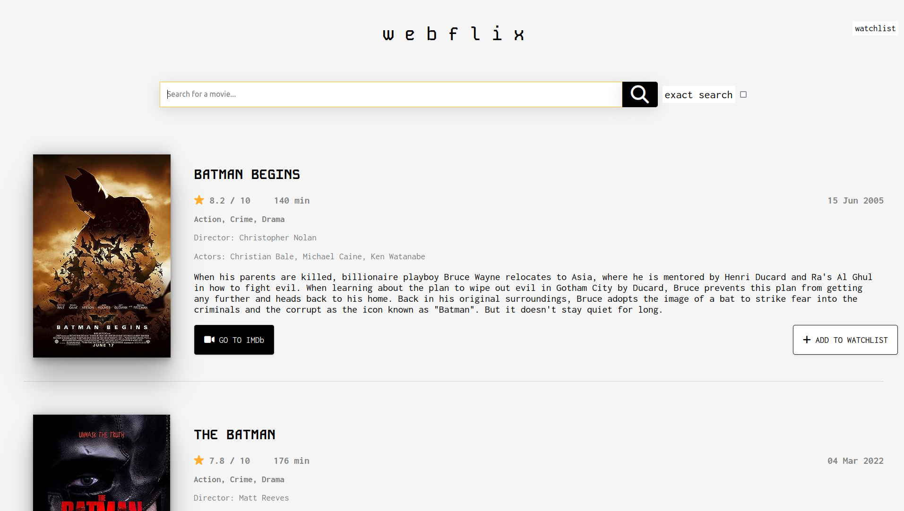

# Webflix

Webflix is a web application that serves as an alternative minimal frontend to IMDb, powered by the OMDB API. It allows users to search for movies, view detailed information about them, and manage their watchlist.



## Features

    Search: Users can search for movies by title.
    Movie Details: Detailed information about each movie, including ratings, cast, plot, and more, is displayed.
    Watchlist: Users can add movies to their watchlist for later viewing.
    IMDb Integration: Utilizes the OMDB API to fetch movie data, providing an alternative interface to IMDb.

## Technologies Used

    HTML/CSS/JavaScript: Frontend development.
    ViteJS: Lightweight development tooling.
    OMDB API: Fetches movie data for display.
    Local Storage: Stores watchlist data locally on the user's browser.

## Getting Started

```bash
    git clone https://github.com/tadej-jernejcic/webflix.git
    cd webflix
    npm i
    npm run dev
```

## License

This project is licensed under the MIT License.
